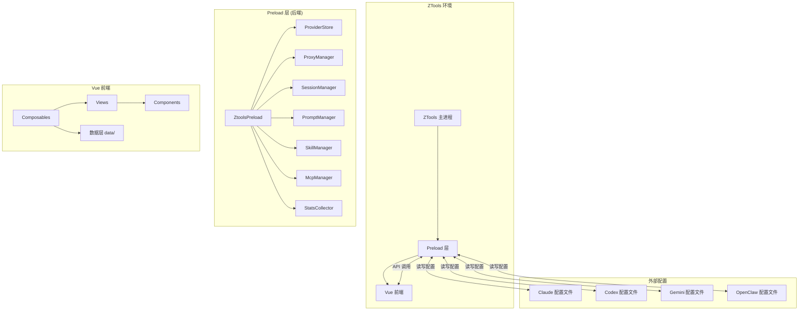

<p align="center">
  
</p>

<h1 align="center">CCToggle</h1>

<p align="center">
  <strong>ZTools 插件 | AI CLI 一键切换工具</strong>
</p>

<p align="center">
  为 Codex、Claude、Gemini、OpenClaw 等主流 AI CLI 工具管理多套 API 配置，点击即可切换 baseUrl、模型、密钥等参数，无需手动改配置文件。
</p>

---

## ✨ 功能特性

- 🔄 **一键切换** - 快速切换不同 AI 服务供应商的配置
- 🌐 **内置代理** - 自带代理服务器，支持请求转发和负载均衡
- 📊 **用量统计** - 统计各供应商的 API 调用量、Token 消耗等
- 🛣️ **路由管理** - 支持配置路由组，灵活管理多个供应商
- 📦 **技能管理** - 搜索和安装社区技能
- 🎯 **预设配置** - 内置主流供应商预设，开箱即用

## 🚀 支持的 AI 工具

| 工具 | 说明 |
|------|------|
| **Codex** | OpenAI Codex CLI |
| **Claude** | Anthropic Claude Code |
| **Gemini** | Google Gemini CLI |
| **OpenClaw** | OpenClaw CLI |

## 📦 支持的供应商

### 官方供应商

- OpenAI Official
- Claude Official (Anthropic)
- Google Official
- Azure OpenAI

### 国内供应商

- DeepSeek
- Kimi / Kimi For Coding
- 通义千问 (Qwen Coder)
- 豆包 (DouBaoSeed)
- MiniMax
- 智谱 (StepFun)
- 小米 MiMo
- 百度千帆
- 阿里百炼

### 聚合平台

- OpenRouter
- SiliconFlow
- AiHubMix
- Novita AI
- NVIDIA
- ModelScope
- 更多...


## 📸 截图

<p align="center">
  <em>coming soon...</em>
</p>

## 🛠️ 安装使用

### 前置要求

- [ZTools](https://ztoolscenter.github.io/ZTools-doc/) - 跨平台效率工具

### 安装插件

1. 打开 ZTools
2. 搜索 `cctoggle`
3. 安装插件

### 开发环境

```bash
# 克隆项目
git clone <your-repo>/ZTools-cctoggle.git
cd ZTools-cctoggle

# 安装依赖
pnpm install

# 启动开发服务器（ZTools 模式）
pnpm dev:all

# 启动开发服务器（浏览器模式，不需要 ZTools）
pnpm dev:browser

# 构建生产版本
pnpm build
```

### 开发技能

本项目内置了 ZTools 插件开发技能，克隆项目后在 opencode 中打开即可自动加载：

- 技能文件位于 `.opencode/skills/ztools-plugin/SKILL.md`

## 🧪 自动化测试

基于 [Playwright](https://playwright.dev/) 的端到端（E2E）测试。

### 运行测试

```bash
# 运行全部 E2E 测试
pnpm test:e2e

# UI 模式（可视化运行/调试）
pnpm test:e2e:ui
```

### 工作原理

- 测试配置：`playwright.config.ts`
  - 测试目录：`test/`（按模块分子目录：`providers` / `proxy` / `skills` / `mcp` / `settings` / `stats`）
  - 浏览器：Chromium（`Desktop Chrome`）
  - 自动启动开发环境：配置了 `webServer`，运行 `pnpm dev:browser`（浏览器模式 + dev API server），`baseURL` 为 `http://localhost:5273`
- 测试产物：HTML 报告输出到 `test-results/report/`，失败截图/轨迹到 `test-results/artifacts/`
- CI 行为：设置 `CI` 环境变量后自动启用 `forbidOnly`、`retries: 2`、单 worker
- `test-results/` 已加入 `.gitignore`，不进入版本库

### 编写测试

在 `test/` 下对应模块目录创建 `*.spec.ts`，沿用现有 Playwright 约定（`page.goto('/')` + 断言即可）。运行前请先 `pnpm install` 并确保 5273 端口未被占用。

## 📖 使用说明

### 基本使用

1. 呼出 ZTools 搜索框
2. 输入 `cc` 或 `cctoggle` 唤起插件
3. 选择要使用的 AI 工具（Codex/Claude/Gemini/OpenClaw）
4. 点击供应商卡片即可切换配置

### 代理模式

插件内置代理服务器，可以：

- 统一管理 API 密钥
- 自动负载均衡
- 记录请求日志
- 统计用量数据

### 路由配置

支持配置路由组，实现：

- 多供应商轮询
- 故障自动切换
- 自定义路由规则

## 🏗️ 项目结构

### 📁 目录树

```
ztools-cctoggle/
├── public/                          # 静态资源
│   ├── logo.png                     # 插件图标
│   ├── plugin.json                  # ZTools 插件配置
│   └── preload/                     # 编译产物（自动生成）
│
├── src/
│   ├── preload/                     # 🔧 后端模块（ZTools preload 环境）
│   │   ├── preload.ts               # 主入口：ZtoolsPreload 类
│   │   ├── provider-db.ts           # ProviderStore - 供应商 CRUD
│   │   ├── proxy.ts                 # ProxyManager - 代理服务器
│   │   ├── proxy-daemon.ts          # 代理守护进程
│   │   ├── proxy-converter.ts       # 配置格式转换
│   │   ├── sessions.ts              # SessionManager - 会话扫描
│   │   ├── prompts.ts               # PromptManager - 提示词管理
│   │   ├── skills.ts                # SkillManager - 技能部署
│   │   ├── mcp.ts                   # McpManager - MCP 配置
│   │   ├── stats.ts                 # StatsCollector - 用量统计
│   │   ├── test-connection.ts       # 连接测试
│   │   ├── cleanup.ts               # 数据迁移
│   │   ├── config-rw.ts             # 配置文件读写
│   │   └── utils.ts                 # 工具函数
│   │
│   ├── components/                  # 🧩 Vue 组件
│   │   ├── common/                  # 通用组件
│   │   │   ├── AppDashboard.vue     # 仪表盘
│   │   │   ├── AppFooter.vue        # 底部栏
│   │   │   ├── TabBar.vue           # 标签栏
│   │   │   └── EChart.vue           # 图表组件
│   │   ├── provider/                # 供应商相关
│   │   │   ├── ProviderCard.vue     # 供应商卡片
│   │   │   ├── ProviderForm.vue     # 供应商表单
│   │   │   └── PresetChips.vue      # 预设标签
│   │   ├── session/                 # 会话相关
│   │   ├── prompt/                  # 提示词相关
│   │   ├── mcp/                     # MCP 相关
│   │   ├── skills/                  # 技能相关
│   │   └── routes/                  # 路由相关
│   │
│   ├── composables/                 # 🎣 组合式函数
│   │   ├── shared.ts                # 共享常量和工具
│   │   ├── useProviders.ts          # 供应商管理
│   │   ├── useRoutes.ts             # 路由管理
│   │   ├── useSession.ts            # 会话管理
│   │   ├── usePrompts.ts            # 提示词管理
│   │   ├── useSkills.ts             # 技能管理
│   │   ├── useMcp.ts                # MCP 管理
│   │   ├── useStats.ts              # 统计数据
│   │   ├── useTheme.ts              # 主题切换
│   │   └── useAppMessage.ts         # 消息提示
│   │
│   ├── views/                       # 📄 页面视图
│   │   ├── ProviderListPage.vue     # 供应商列表页
│   │   ├── SessionPage.vue          # 会话管理页
│   │   ├── PromptsPage.vue          # 提示词管理页
│   │   ├── McpPage.vue              # MCP 管理页
│   │   └── settings/                # 设置页面
│   │       ├── ClaudeSettings.vue   # Claude 设置
│   │       └── RoutesSettings.vue   # 路由设置
│   │
│   ├── data/                        # 📊 数据定义
│   │   ├── presets.ts               # 预设入口
│   │   ├── presets-claude.ts        # Claude 预设
│   │   ├── presets-codex.ts         # Codex 预设
│   │   ├── presets-gemini.ts        # Gemini 预设
│   │   ├── presets-openclaw.ts      # OpenClaw 预设
│   │   ├── providers.ts             # 供应商元数据
│   │   └── prompt-templates.ts      # 提示词模板
│   │
│   ├── themes/                      # 🎨 主题配置
│   │   ├── index.ts                 # 主题入口
│   │   ├── buildOverrides.ts        # 主题构建器
│   │   ├── amber.ts                 # 琥珀主题
│   │   ├── midnight.ts              # 午夜主题
│   │   └── deepnight.ts             # 深夜主题
│   │
│   ├── types/                       # 📝 TypeScript 类型
│   │   ├── ztools-cctoggle.d.ts    # 业务类型定义
│   │   └── env.d.ts                 # 环境类型
│   │
│   ├── utils/                       # 🛠️ 前端工具
│   │   ├── browser-adapter.ts       # 浏览器适配器
│   │   ├── markdown.ts              # Markdown 渲染
│   │   └── openUrl.ts               # URL 打开
│   │
│   ├── router/                      # 🛣️ 路由配置
│   │   └── index.ts
│   │
│   ├── main.ts                      # 前端入口
│   ├── setup.ts                     # ZTools 命令注册
│   └── App.vue                      # 根组件
│
├── scripts/                         # 📜 构建脚本
│   ├── build-preload.cjs            # Preload 构建
│   └── dev-api-server.cjs           # 浏览器模式 API 服务器
│
├── package.json
├── vite.config.ts
├── tsconfig.preload.json
└── README.md
```

### 🏛️ 架构图



### 📦 模块职责

| 模块 | 文件 | 职责 |
|------|------|------|
| **入口** | `preload.ts` | 初始化所有管理器，暴露 API |
| **供应商** | `provider-db.ts` | CRUD、切换、导入导出 |
| **代理** | `proxy.ts` | 代理服务器、负载均衡 |
| **会话** | `sessions.ts` | 扫描和管理 Claude 会话 |
| **提示词** | `prompts.ts` | 提示词管理、备份恢复 |
| **技能** | `skills.ts` | 技能安装、部署、同步 |
| **MCP** | `mcp.ts` | MCP 服务器配置 |
| **统计** | `stats.ts` | API 用量统计 |

## 🤝 贡献指南

欢迎贡献代码、提交 Issue 或 PR！

1. Fork 本仓库
2. 创建你的特性分支 (`git checkout -b feature/AmazingFeature`)
3. 提交你的改动 (`git commit -m 'feat: Add some AmazingFeature'`)
4. 推送到分支 (`git push origin feature/AmazingFeature`)
5. 打开一个 Pull Request

### 添加新供应商

1. 在 `src/data/providers.ts` 中添加供应商元数据
2. 在对应的 `src/data/presets-*.ts` 中添加预设配置
3. 测试配置是否正确

## 📄 开源协议

本项目采用 [MIT License](LICENSE) 开源协议。

## 🙏 致谢

- [cc-switch](https://github.com/farion1231/cc-switch) - 本项目的灵感来源
- [ZTools](https://ztoolscenter.github.io/ZTools-doc/) - 跨平台效率工具
- [Vue.js](https://vuejs.org/) - 渐进式 JavaScript 框架
- [Vite](https://vitejs.dev/) - 下一代前端构建工具
- 所有贡献者和供应商合作伙伴

---

<p align="center">
  Made with ❤️ by <a href="https://github.com/Cifferni">Cifferni</a>
</p>
